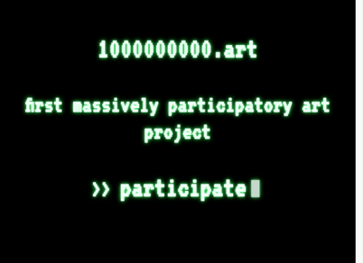
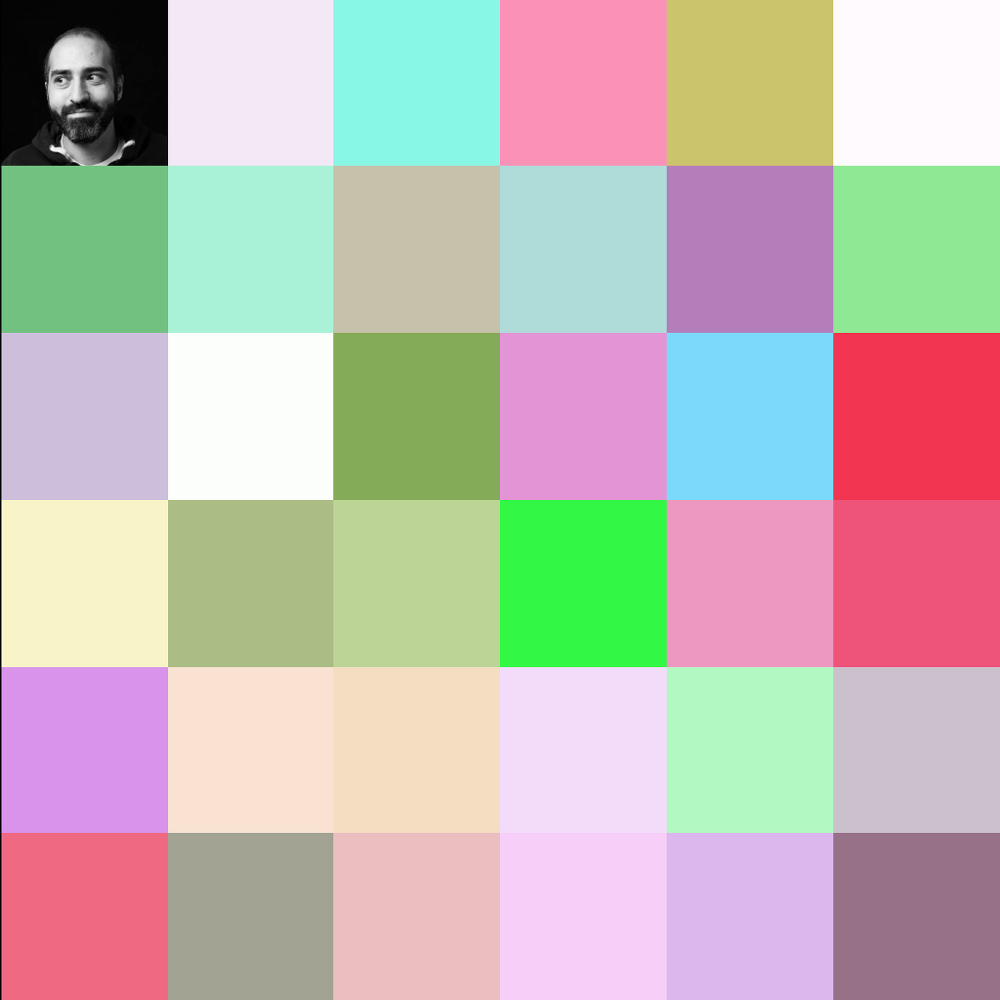

# 1000000000.art  

[The painting right now (big size)](https://api.1000000000.art)
<br/>[Download the painting (reale tiny size)](https://1000000000.s3.amazonaws.com/Art0x.png) 




Participate : [1000000000.art](https://1000000000.art)

## First massively participatory art project

Art01 is a painting, Its size will be 40,000 px wide by 25,000 pixel high. That is a 1 000 000 000 pixels.

This painting requires **a billion** participants to be completed.

Every pixel is added by one person, you for example. When you first signs in and visualizes the artwork, a colored dot corresponding to your IP address is added. It's your pixel.

```
For example : your IP is 78.234.74.82

Your RGB color is rgb(78,234,74)

Red :  78 
Green : 234
Blue : 74

And your opacity is between 0 (0) and 1 (255).
Opacity for 82 => 0.32

Final RGB color with opacity : rgba(78,234,74,0.32) :

```


This rectangular painting is only an example of representation. The artwork is made up of data provided by people over time, not its appearance.

## Co-create the biggest piece of art in history.


]


Did you say "participatory Art" ? 👉 https://en.wikipedia.org/wiki/Participatory_art


For the moment, 1 people have participated to this project since its beginning, 3 days ago. 0.00000% of the painting is complete

At this rate, ART01 will never be finished.


## How are pixels added ?

I use a [Ulam spiral](https://en.wikipedia.org/wiki/Ulam_spiral)  to add each pixels, the first one the first being in the center :


## How are pixels stored ?

I use eventsourcing pattern. Take a look : [eventstore](https://eventstore.js.org/)  

## How to donwload the painting ?

[Here](https://art01-images.s3.eu-west-3.amazonaws.com/Art0x.png)  

## API

Number of pixels : https://api.1000000000.art/api/pixels/count


## Available Scripts

In the project directory, you can run:

### `yarn dev`

Runs the front react app in the development mode.<br />
Open [http://localhost:3000](http://localhost:3000) to view it in the browser.

The page will reload if you make edits.<br />
You will also see any lint errors in the console.

### `yarn test`

Launches the test runner in the interactive watch mode.<br />
See the section about [running tests](https://facebook.github.io/create-react-app/docs/running-tests) for more information.

### `yarn build`

Builds the app for production to the `build` folder.<br />
It correctly bundles React in production mode and optimizes the build for the best performance.

The build is minified and the filenames include the hashes.<br />
Your app is ready to be deployed!

See the section about [deployment](https://facebook.github.io/create-react-app/docs/deployment) for more information.

### `yarn eject`

**Note: this is a one-way operation. Once you `eject`, you can’t go back!**

If you aren’t satisfied with the build tool and configuration choices, you can `eject` at any time. This command will remove the single build dependency from your project.

Instead, it will copy all the configuration files and the transitive dependencies (Webpack, Babel, ESLint, etc) right into your project so you have full control over them. All of the commands except `eject` will still work, but they will point to the copied scripts so you can tweak them. At this point you’re on your own.

You don’t have to ever use `eject`. The curated feature set is suitable for small and middle deployments, and you shouldn’t feel obligated to use this feature. However we understand that this tool wouldn’t be useful if you couldn’t customize it when you are ready for it.

### Launch Node express back/api

cd /api
nodemon

See it at http://localhost:3001/


